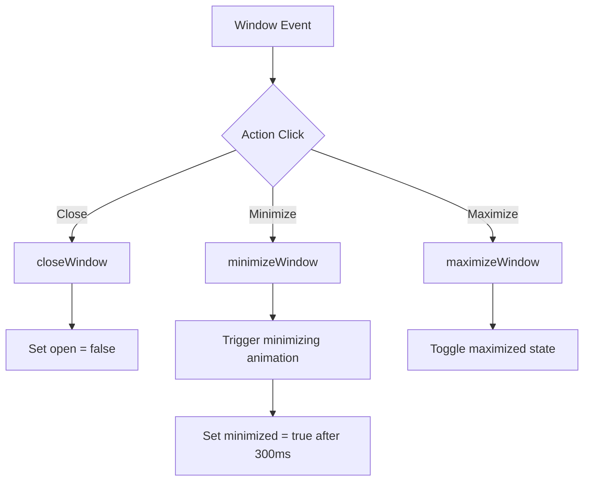

# macOS Desktop Environment - Architecture & Implementation Guide

This guide explains the inner workings, data structures, and mechanics behind the macOS-style portfolio workspace in this Angular application.

---

## 1. High-Level UI Architecture

The page operates in two main modes toggled by the **Settings** gear in the Dock:
1. **Classic Mode**: A standard, modern single-page scrollable portfolio.
2. **macOS Mode**: An interactive desktop environment.

When **macOS Mode** is active:
* The default scrollbars are hidden, and the viewport fits `100vw` and `100vh` exactly.
* The workspace is layered into three main components:
  1. **Background Wallpaper**: Styled dynamically with CSS filters and gradients.
  2. **Interactive Desktop**: Hosts absolute-positioned icons and floating application windows.
  3. **Dock**: Renders centered at the bottom, holding active shortcuts and minimized indicators.

---

## 2. Window State Management

Floating windows are managed through a central reactive state object in [home.component.ts](file:///Users/prosenjit/Desktop/Projects/Portfolio_New/portfolio/src/app/components/home/home.component.ts).

### The `WindowState` Interface
Each window's configuration and runtime layout position are stored inside the `windows` dictionary:
```typescript
interface WindowState {
  id: string;        // Unique identifier (e.g. 'about', 'finder')
  title: string;     // Text displayed in the header title bar
  open: boolean;     // Whether the window is currently spawned
  minimized: boolean;// Hidden from desktop, accessible from Dock
  maximized: boolean;// Fills the entire desktop screen (full-screen)
  x: number;         // Left coordinate offset in pixels
  y: number;         // Top coordinate offset in pixels
  zIndex: number;    // Stack index layer order
  minimizing?: boolean; // Controls CSS transition classes
  restoring?: boolean;  // Controls scale-up animation classes
}
```

### Stack Layers (Focus & Z-Indexing)
When multiple windows are open, clicking on a window or its Dock icon must bring it to the foreground. This is managed via `focusWindow(id)`:
* It reads the current highest layer index (`maxZIndex`).
* Increments `maxZIndex` by 1.
* Assigns this new value to the selected window's `zIndex`.
* Inside [home.component.html](file:///Users/prosenjit/Desktop/Projects/Portfolio_New/portfolio/src/app/components/home/home.component.html), the window elements are bound inline: `[style.z-index]="windows[id].zIndex"`.

### Window Controls Operations


1. **Open**: `openWindow(id)` sets `open = true`, resets `minimized = false`, and invokes `focusWindow(id)`.
2. **Close**: `closeWindow(id, event)` stops propagation (to prevent desktop clicks) and sets `open = false`.
3. **Minimize**: `minimizeWindow(id, event)` adds a `.minimizing-window` CSS class. After a `300ms` window collapse transition, `minimized = true` takes effect.
4. **Maximize**: `maximizeWindow(id, event)` toggles `maximized = !maximized`. If maximized, the CSS sets width and height to `100%`, overrides position settings, and locks coordinates.

---

## 3. Window Dragging Mechanics

To make windows draggable, the app tracks mouse and touch events natively without relying on heavy external libraries.

### Drag Hooks & Coordinate Handlers
The window header bar binds the dragging hook:
```html
<div class="mac-window-header" 
     (mousedown)="onMouseDown($event, id)" 
     (touchstart)="onTouchStart($event, id)">
```

1. **MouseDown (`onMouseDown(event, id)`)**:
   * Saves the starting client coordinates: `dragStartX = event.clientX`, `dragStartY = event.clientY`.
   * Saves the window's starting offset position: `windowStartX = windows[id].x`, `windowStartY = windows[id].y`.
   * Sets dragging locks: `isDragging = true`, `draggedWindowId = id`.
   * Brings the window to the foreground (`focusWindow(id)`).

2. **MouseMove (`onMouseMove(event)`)**:
   * Triggered globally via `@HostListener('window:mousemove')`.
   * Calculates displacement delta: `deltaX = event.clientX - dragStartX`, `deltaY = event.clientY - dragStartY`.
   * Sets the updated position:
     ```typescript
     this.windows[this.draggedWindowId].x = this.windowStartX + deltaX;
     this.windows[this.draggedWindowId].y = this.windowStartY + deltaY;
     ```
   * Enforces screen-edge bounds checking to prevent dragging headers out of the viewport.

3. **MouseUp (`onMouseUp()`)**:
   * Releases mouse focus flags: `isDragging = false`, `draggedWindowId = null`.

---

## 4. Desktop Icons Layout & Positioning

Desktop icons are rendered inside a vertical column grid dynamically positioned based on screen height.

### Layout Initialization
`initIconPositions()` calculates where to draw icons:
* Grid dimensions are computed: `rowHeight = 90` pixels, `columnWidth = 85` pixels.
* The workspace bounds are derived from `window.innerHeight` and `window.innerWidth`.
* It loops through each item in `desktopIcons` and calculates row/column indices to fit them in a vertical column starting from the top-left:
  ```typescript
  const rowsPerColumn = Math.floor((desktopHeight - topBarHeight - dockHeight) / rowHeight);
  const colIndex = Math.floor(index / rowsPerColumn);
  const rowIndex = index % rowsPerColumn;
  
  icon.x = colIndex * columnWidth + leftMargin;
  icon.y = rowIndex * rowHeight + topMargin;
  ```

### Dragging Icons
Similar to windows, icons implement `onIconMouseDown` and coordinates offset tracking. When dropped, the custom positions `icon.x` and `icon.y` are stored in memory, allowing you to freely place icons anywhere on the screen.

---

## 5. Dock Drag-and-Drop Features

The Dock supports two interaction profiles: **icon reordering** and **pinning new items**.

```
    DESKTOP FILE                              DOCK ITEMS
+-------------------+                   +-----------------------+
|    Resume.pdf     |                   |  Finder | Google | .. |
|  [Drag Start]     |                   +-----------------------+
+---------+---------+                               ^
          |                                         |
          +----(Track drop coordinates check)-------+
                      [Drop inside Dock rect] -> Pinned!
```

### Dock Icon Reordering (HTML5 Drag & Drop)
The Dock items use native HTML5 drag-and-drop events:
* **DragStart (`onDockDragStart(event, index)`)**: Stores the array index of the icon being dragged.
* **DragOver (`onDockDragOver(event)`)**: Prevents default browser handling to allow dropping.
* **Drop (`onDockDrop(event, targetIndex)`)**: Splices the array `dockItems`, moving the source icon from its original index to the target index:
  ```typescript
  const movedItem = this.dockItems.splice(this.draggedDockIndex, 1)[0];
  this.dockItems.splice(targetIndex, 0, movedItem);
  ```

### Pinning Desktop Icons to the Dock
When dragging a desktop file icon (e.g. `Resume.pdf`), dropping it over the Dock boundaries pins it as a shortcut:
1. Global mouse move tracks client coordinates in `lastMouseX` and `lastMouseY`.
2. On `mouseup`, if an icon was being dragged:
   * We read the bounding rectangle coordinates of the Dock element: `.mac-dock` bounding client rect.
   * If the drop coordinates (`lastMouseX`, `lastMouseY`) intersect with the Dock's bounding rect:
     ```typescript
     if (x >= rect.left && x <= rect.right && y >= rect.top && y <= rect.bottom) {
       this.pinIconToDock(iconId);
     }
     ```
3. `pinIconToDock(id)` extracts the desktop icon configuration, maps it into a new Dock shortcut node, pushes it to `dockItems`, and triggers success logs.

---

## 6. macOS Finder (File Explorer)

The **Finder** window mimics standard directory structures with a virtual hierarchy.

### Navigation History Stack
Finder tracks navigation history using a state history stack:
* `currentPath` holds the active directory path (e.g. `'/Desktop'`).
* `finderHistory` stores path traversal history (e.g. `['/', '/Desktop', '/Desktop/Documents']`).
* `finderHistoryIndex` points to the active index in the stack.
* Clicking **Back** (`goFinderBack()`) decrements the index and loads the path. Clicking **Forward** (`goFinderForward()`) increments the index.

### Grid Viewer & Double-Click Router
Double-clicking files/folders invokes `onFinderItemDblClick(item)`:
* **Folders**: Calls `navigateFinder(item.targetPath)`.
* **Applications**: Launches the corresponding window via `openWindow(item.windowId)`.
* **Files**: If the file is `resume_pdf`, it opens the Resume Viewer Preview window. Other text files open inside the TextEdit notepad app.

---

## 7. Custom Resume Viewer ("Preview.app")

The **Resume Viewer** displays Prosenjit's resume in a premium layout mimicking macOS Preview:
* **Toolbar Actions**: Incorporates a prominent `Download PDF` action button which hooks directly to `downloadCV()`.
* **Document Canvas**: Uses CSS to simulate a physical white A4/Letter page sheet with subtle paper shadows, rendering professional typography, tabular skill structures, and neat section borders.

---

## 8. macOS Control Center (Action Center)

The Control Center provides central access to system configurations via sliders and toggles, matching the macOS Big Sur/Sonoma aesthetic.

### Component State
Managed reactively in [home.component.ts](file:///Users/prosenjit/Desktop/Projects/Portfolio_New/portfolio/src/app/components/home/home.component.ts):
* `wifiActive`: boolean (simulated network connection state)
* `bluetoothActive`: boolean (simulated bluetooth controller)
* `airdropActive`: boolean (simulated local share permissions)
* `dndActive`: boolean (simulated Do Not Disturb toggle)
* `stageManagerActive`: boolean (simulated desktop organization layout toggle)
* `brightness`: number (0-100 scale value)
* `volume`: number (0-100 scale value)
* `isPlayingMusic`: boolean (toggles media state)

### Display Brightness Workflow (Overlay Dimming)
Rather than adjusting CSS filters on individual elements which would degrade hardware acceleration, the workspace simulates screen brightness via a global fixed overlay:
1. A `<div class="brightness-overlay">` is positioned fixed at `z-index: 99999` with `background: black`.
2. Its style binds opacity dynamically: `[style.opacity]="(100 - brightness) * 0.0075"`.
3. To prevent this overlay from blocking clicks, it is styled with `pointer-events: none`, allowing mouse and touch events to pass straight through.

### Sound Volume Workflow (Web Audio Sound Synthesis)
The volume slider plays a real feedback beep when adjusted, generated programmatically to avoid loading external audio file assets:
1. When the slider triggers an `(input)` event, it calls `playVolumeBeep()`.
2. It instantiates a temporary HTML5 `AudioContext`.
3. It creates an `OscillatorNode` (generating a sine wave at `800Hz`) and a `GainNode` (controlling amplitude).
4. The oscillator connects to the gain node, and the gain node connects to the audio destination.
5. The gain level decays exponentially: `gainNode.gain.exponentialRampToValueAtTime(0.001, currentTime + 0.1)`.
6. This synthesizes a clean, high-frequency "tink" sound matching the volume setting.

---

## 9. macOS Notification Panel & Widgets

The Notification Panel displays real-time system performance widgets and clearable alerts.

### Click-Outside Dismissal Workflow
A common UX issue with desktop drawers is dismissing them when clicking outside. The panel implements robust event tracking:
1. Inside [home.component.ts](file:///Users/prosenjit/Desktop/Projects/Portfolio_New/portfolio/src/app/components/home/home.component.ts), a document click listener is registered:
   ```typescript
   @HostListener('document:click', ['$event'])
   onDocumentClick(event: MouseEvent) { ... }
   ```
2. The trigger button wraps the clock element with click events: `toggleNotificationPanel($event)`.
3. It calls `event.stopPropagation()` to prevent the click from immediately bubbling up to the document level (which would cause the panel to open and immediately close).
4. Clicking anywhere *inside* the panel binds `(click)="$event.stopPropagation()"` to lock focus.
5. Clicking anywhere *outside* bubbles up to the `@HostListener('document:click')` which sets `showNotificationPanel = false`.

### Real-Time Widget Modules
* **Weather Widget**: Renders a localized display for Kolkata, utilizing CSS gradients (`linear-gradient(135deg, #2a5298, #1e3c72)`) to mock standard iOS weather components.
* **Screen Time Widget**: Draws a percentage-based green filling progress bar representing relative dev workspace active timings.
* **System Performance Widget**: Evaluates and displays mock CPU load metrics and active system Memory levels.

---

## 10. Interactive Photo Booth Application

Photo Booth utilizes HTML5 camera streaming, canvas context mirroring, and visual filter effects to replicate the classic Mac utility.

### Camera Access & Capture Workflow

```
[ Web Camera Feed ] --(Stream)--> [ HTML5 <video> ] --(Mirror + CSS Filters)--> [ Viewport Screen ]
                                         |
                                (Shutter Triggered)
                                         |
                                         v
 [ Captured JPEG ] <--(Canvas Data)-- [ Canvas 2D ] <--(Mirror + Filter context)
```

1. **Camera Start**: Opening the Photo Booth window invokes `startPhotoBoothCamera()`. It queries `navigator.mediaDevices.getUserMedia({ video: true })` and binds the resulting `MediaStream` track object directly to the `<video>` element's `srcObject`.
2. **Countdown Ticks**: Clicking the shutter button sets a 3-second countdown loop (`setInterval`). On each tick, it plays a low-latency beep sound (`1000Hz`) via programmatic AudioContext oscillators.
3. **Screen Flash Effect**: When the countdown reaches 0, the interval clears, and `photoBoothFlash` is set to `true`. This overlays a white fullscreen absolute element (`opacity: 0.95`), which fades out instantly using CSS keyframe animations. A camera click beep (`1600Hz`) plays simultaneously.
4. **Canvas Processing & Mirroring**: 
   * An offscreen `<canvas>` element is generated with matching video track dimensions.
   * Because webcams are mirrored, the canvas context is flipped horizontally using `ctx.translate(width, 0)` and `ctx.scale(-1, 1)`.
   * The selected CSS filter (e.g. `sepia(100%)`, `grayscale(100%)`) is mapped to the canvas context: `ctx.filter = getCanvasFilter(activeFilter)`.
   * `ctx.drawImage(videoEl, 0, 0)` pulls the active video pixel frame.
   * `canvas.toDataURL('image/jpeg')` produces a base64 snapshot string which is unshifted to `photoBoothPhotos`.
5. **Download snaps**: Clicking a snap creates a temporary `<a>` element, sets the `href` to the image's base64 string, assigns the `download` property to a timestamped filename, and executes a programmatic click event.
6. **Camera Stop (Privacy Safeguard)**: When the Photo Booth window is closed or minimized, `stopPhotoBoothCamera()` is invoked. It loops through all tracks in the active stream and calls `.stop()`, ensuring the camera hardware light turns off immediately.

---

## 11. Desktop Icon Grid Wrapping

Desktop icons are rendered inside a vertical column grid dynamically positioned based on screen height to prevent overlapping.

### Wrapping Algorithm
Rather than positioning icons along a single column which overflows on small viewports, `initIconPositions()` wraps icons to a new column on the left:
1. Derives total row height bounds (`90px`), column width bounds (`95px`), and top margin offsets.
2. Calculates the maximum number of rows that can fit vertically on the screen:
   ```typescript
   const maxRows = Math.max(1, Math.floor((desktopHeight - 130) / rowGap));
   ```
3. Resolves grid coordinates for each icon:
   ```typescript
   const col = Math.floor(index / maxRows);
   const row = index % maxRows;
   icon.x = startX - (col * columnGap); // Arrange column wrapping from right to left
   icon.y = startY + (row * rowGap);
   ```
4. This ensures that new icons wrap to a second column to the left of the right edge, maintaining pixel-perfect visibility.

